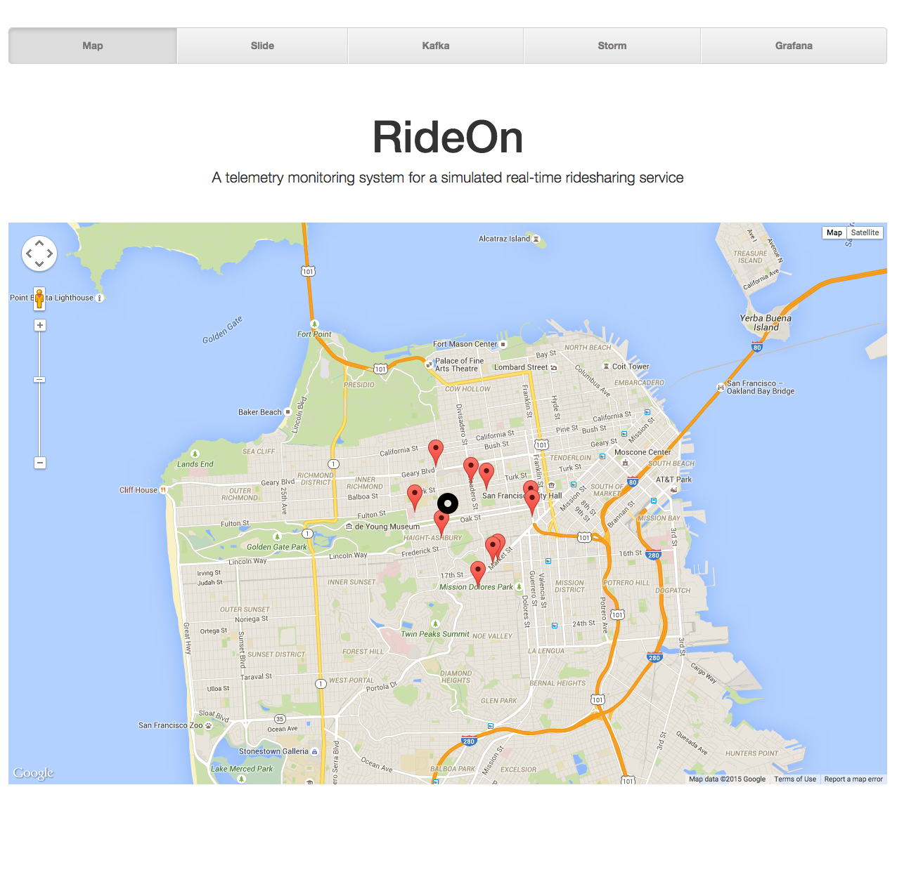

RideOn Website
=================

This is the front end for [RideOn](mydiemho/rideon), my big data project as part of [Insight Data Science's](http://insightdataengineering.com/) Engineering fellowship program from June 2015 through July 2015.
	
	
## Dependencies
Instructions are specific to Debian/Ubuntu.

### General

	sudo apt-get update
	sudo apt-get upgrade
	
### Flask and Pip

	sudo apt-get install python-pip python-dev build-essential
	sudo pip install flask

## Usage
	
	python run.py
	
You can then visit your public IP in the browser (localhost if you’re running on your local system).  The site is at port 5000.

## Screen Shot

